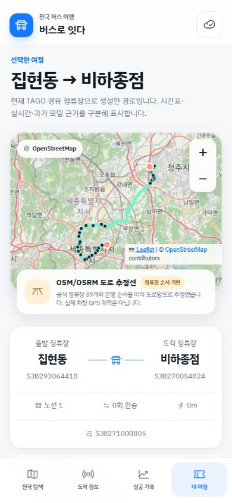
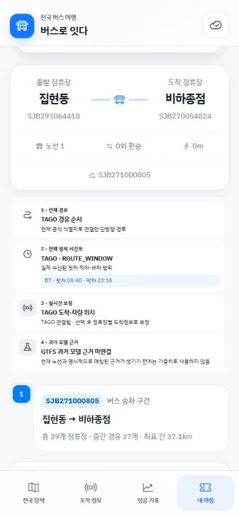

# 버스로 잇다

> 전국 시내버스만 이어 대한민국을 여행하는 경로 탐색 웹 앱

[](https://busro-itda.vercel.app)
[](opendesign/mockups/busro-itda-glass/service)
[](https://www.openstreetmap.org/)

**[웹 앱 열기](https://busro-itda.vercel.app)** · **[서비스/API 문서](opendesign/mockups/busro-itda-glass/service/README.md)**

## 핵심 기능

- 전국 정류장·노선 검색과 방향성 Dijkstra 경로 탐색
- 최소환승·균형·여행우선 조건별 대안 경로 생성
- TAGO API 기반 실시간 도착·차량 위치 조회
- 정류장 순서와 OSM 도로망을 이용한 실제 구간 지도
- 공식 시간표·운행 관측 근거가 있을 때만 성공 가능성 계산
- 모바일 우선 흰색 글래스모피즘 UI

<p align="center">
  
  
</p>

## 데이터 현황

| 항목 | 현재 포함량 |
|---|---:|
| 정류장 카탈로그 | 227,054건 |
| 노선 카탈로그 | 7,239건 |
| 방향성 노선 시퀀스 | 5,247건 |
| 방향성 정류장 행 | 301,379건 |
| 지자체 코드 | 138개 |
| 배포 카탈로그 | SQLite 160.9 MiB / 압축 39.0 MiB |

정적 카탈로그는 국토교통부·TAGO 계열 식별자와 수집된 방향 순서를 보존합니다. 시간표나 관측 근거가 부족하면 앱은 값을 추정하지 않고 `DATA_GAP`으로 표시합니다. 과거 GTFS는 현재 시간표를 대신하지 않으며 조발·연착 신뢰도 모델의 근거로만 사용합니다.

## 배포 구조

```text
Browser
  ├─ Vercel static UI
  ├─ /api/* → Python serverless function
  ├─ GitHub Release tar.gz → SHA-256 검증 → /tmp SQLite
  ├─ TAGO API → 실시간 도착·차량 위치
  └─ OSM/OSRM → 노선 구간 지도
```

Vercel에서는 고정 버전 압축 자산의 크기·압축 SHA-256·해제 SHA-256·SQLite 헤더를 확인한 뒤 임시 디렉터리에서 읽습니다. 원본 SQLite와 서비스키는 Git에 넣지 않습니다. 서버리스 파일시스템은 영속 저장소가 아니므로 관측 이력 수집·노선 갱신 API는 현재 차단되어 있습니다.

경로 결과는 카탈로그 revision을 키에 포함한 bounded LRU와 singleflight로 합칩니다. 동일 warm instance의 반복 요청과 같은 브라우저의 최근 후보 경로는 즉시 재사용하지만, Vercel 인스턴스 사이의 공유 캐시는 아직 아닙니다.

## 로컬 실행

```powershell
cd opendesign\mockups\busro-itda-glass\service
python -B server.py --service-key-stdin
```

TAGO 서비스키는 표준입력 또는 서버 환경변수 `TAGO_SERVICE_KEY`로만 전달합니다. 저장소·브라우저 저장소·응답에는 키를 기록하지 않습니다.

## 검증

```powershell
cd opendesign\mockups\busro-itda-glass\service
python -B -m unittest discover -s tests -v
```

서비스 테스트는 API 입력 제한, 동일 출처 정책, TAGO 호출 예산·동시성, SQLite 무결성, 방향성 경로 탐색과 서버리스 저장 경계를 검증합니다.

## 현재 경계

- 현재 배포본은 공식 자료로 확인된 부분 그래프이며, 전국 모든 노선이 최신 방향 순서·시간표를 가진 것은 아닙니다.
- TAGO 제공 범위와 지자체 데이터 품질에 따라 실시간 조회 가능 여부가 다릅니다.
- Vercel 배포에서는 이력 쓰기가 영속적이지 않으므로 수집 API를 의도적으로 비활성화했습니다.
- 이 저장소에는 API 키와 운영 데이터베이스를 포함하지 않습니다.
